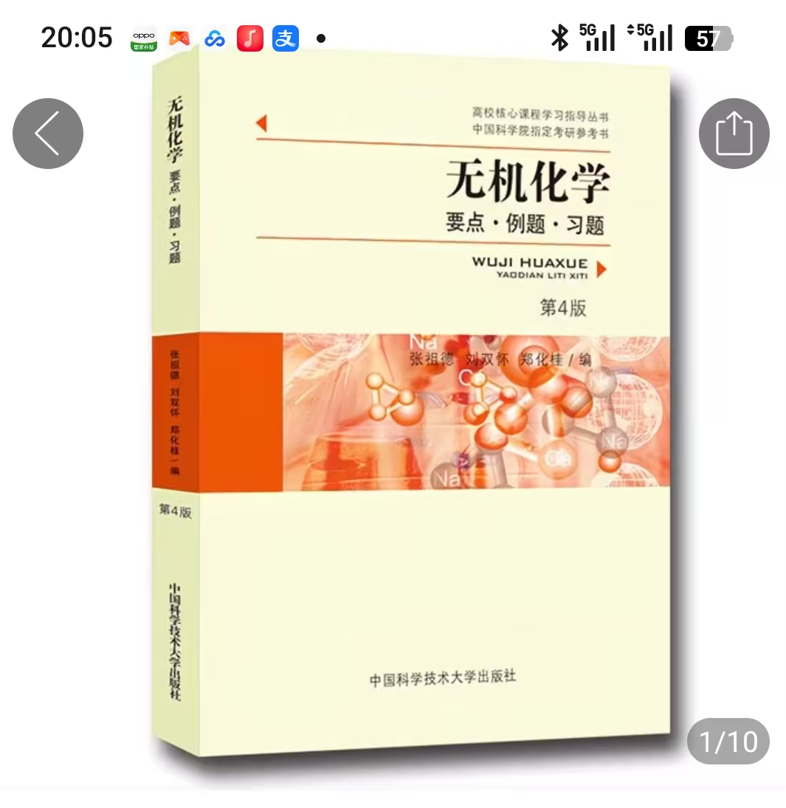
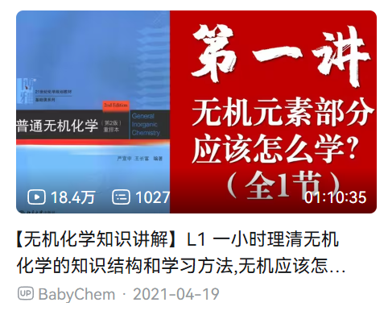
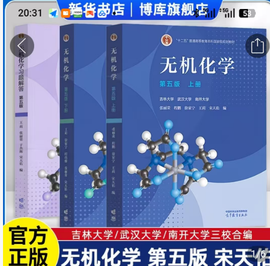
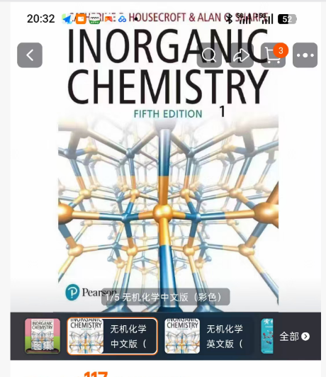

# 大一上

## 高数B（I）/特殊班高数A（I）
高等数学是所有理工科都绕不开的一门专业课，在物化2-1、仪器分析、结构化学等专业课中有很多应用。高数（I）作为高数的基础，从重新书写极限语言开始，一步一步推导出序列极限，函数极限，再到导数，拉格朗日，柯西中值定理，最后到不定积分和定积分。高数要展开说实在太过纷杂，详细的我就留给其他同学言说了。这里只讲讲怎么得4和提高数学思维的一些小方法。

首先，推荐北大高数b讲义（DarkoXie.github.io | Yantong XIE’s homepage），是我读过的最好的高数讲义，弄懂这个讲义，做了上面的题，不要说高数A，就是数分也能一战（因为北大高数B最后一题必是数分题）。这个讲义阅读难度也不大，比看教材要效率高很多（以后再学数学相关的课的时候再也没有找到这么好的讲义了）。上面的习题没有答案，问ai即可（现在ai水平已经可以解决数学界难题了，放心问，但是难题建议
用贵一点的模型）

其次，推荐B站UP主，兆筱小分队。这个入是南开化学生物学系毕业的，后面保研去北大交叉院了，现在在人大附中当化学老师。此人经历比较励志，可做了解。但是更重要的是他的高数视频是基于南开高数的，所以对考试题有奇效。（我当时没有仔细看他的视频，但是年级的同学反响不错）

最后是南开的高数习题课讲义。众所周知，南开的高数书上有许多错误，和很多教材比起来都相当路边，但是南开高数习题课讲义确实是一本好书。上面有ABC三组题，A组题可以涵盖70分的基础内容，B组题可以涵盖剩下24分，C组题涵盖最后6分（可能会有数分题），把习题课讲义作完，外加前面两个推荐路径中的任意一个，考试就可以胸有成竹，第二年还可能在大数赛中获奖。

关于数学思维，这个东西难以言说，但是已知的是，多背证明题，是很有效的方法 （这一点，在平面几何之类体现尤为深刻）。一般来说高数（I）的压轴题是中值定理或者泰勒展开（还是中值定理那些），考察放缩相关的知识（还有函数构造），多背一些题，自然能有题感。

高数不仅是很多化学专业课的基础，也是很多数学、物理课的基础。应用类的交叉方向门槛在当下更低而且上限更高。学好高数给了大家另一条可以选择的道路，既可以选择纯化学方向，也可以做交叉，甚至可以都做，靠交叉赚取资金进行基础研究。

高数作为理科线代（高代）的前置，在修习了理科线代和高数之后，四大力学、泛函分析、复分析、固体物理等课程都可以提上日程进行学习。这给予了化院学生做计算化学机理的机会，甚至还可以去搞经济那边的量化。把路越走越宽才是我们需要追求的。

## 化学概论

什么是化学概论？化学概论是南开独有的无机2-1，高考生最严厉的父亲。作为一门“传奇课程”，化学概论给不知道多少高考生大一新生带来无限的痛苦和折磨。区别于以定性为主，停留在反应现象的高中化学，化学概论对机理和解释提出了更高的要求。

化学概论使用吉大宋天佑版本的教材（第五版），分为普化原理（chemical principle）和元素化学（element chemistry）。其本来应该作为两学期的课程。其中，普化原理包括物化与热学初步——化学热力学和动力学，电极电势，分析化学初步——酸碱滴定（但是不考！），结构化学与原子物理初步——第五章，原子的结构；配位化学初步——晶体场理论。其中，最重要的考点是电极电势——这是占分最多并且最公式化的部分。学完化学热力学之后，要自己推导一遍能斯特方程，不要死记硬背。问问自己，氧化态浓度到底有多少？怎么倒推Ksp？怎么把几个反应加一起来计算反应的K？因此这个部分一定要多做题。关于第五章，要搞懂n,l,m都是什么，它们对应怎么样的图，（径向分布）Slater规则背下来了吗？配位化学里面几种配位记得吗……化学概论里面散的知识点非常之多，切记不要期末突击。

推荐做下图这个习题集，有些题比较困难。

网课可以看babychem的普化原理。

关于元素化学部分，因为是开卷考试，大家可以用粘贴的书签标记每个元素的位置。比较重点的元素有：Hg（亚汞沉淀），Mn（变价多），Fe,Co,Ni（显色和分离），碱土碱金属的通用性质，Al的两性，Cu的配位，Ni的高低场，N的化合物的共轭结构，NO的配位，以及一些元素的配位的立体异构等等，镧系等不考。元素化学一定要自己背反应，否则考试一直翻书来不及！背是化学的基本功。千万不要因为考试开卷的性质就轻视，哪怕再熟练最好也要在考试前把课本过一遍，以便于考试时进行翻阅对照。

关于往年题，在往年资料里面会有，可以找学长学姐要。学有遗力可以阅读housecroft，这本书对无机化合物的结构相关问题有更详尽的阐述，当然如果从大三无机化学的学习角度来看，更建议读南开出版的《无机化学》。

## 无机化学实验 2-1

笔者相当不擅长做实验，无机实验喜提3.3，因此只能分享一些失败的例子。第一，水千万不要加多。无机实验室很多电热器年久失修，水加多了一直反应不完蒸不干，会导致产品不纯和实验时间过长，当然蒸发建议直接用烧杯或者平底坩埚（如果有的话），圆底坩埚蒸的太慢了。第二，结晶要有耐心。晶体生长需要时间，理论上一上午的时间其实不大够。第三，仪器用完一定放回柜子里面，防止被别人拿走。下为教材（注：买书时注意应为南开大学版本，相同封面结构其他学校亦在使用，不要买错）。

再注：课程得分可能与老师有关，这里不做详细讨论，建议咨询学长学姐。

## 思想道德与法治

考前两天再背就行，资料可以找学长学姐要。老师最后一节课可能会划重点，所以记得去。

个人上其实相对推荐听常宴会老师的课，讲的课确确实实能够让人得到启发，但相对的你也要做好给分不一定那么高的预期。（注：此处不使用缩写是因为他课上提过这个事，另外他给分挺好的）

tip：最好上台做个展示，不仅仅是思政课，别的课也一样，展示做得好能给老师留下深刻印象，加好多平时分。

加注：多问问同学，每年都有一个老师会完全按照期末考试题画重点，自己酌情判断即可知道哪个是。

## 英语课

最好不要选英语a班，选b班可能会相对轻松。关于课程考核，主要由期中（听力、阅读、填词），期末（作文），外教课，线上学习这几个板块组成。

首先来谈期中，题型和高考题差别并不大，相对来说高中有基础会更加轻松。考试前有两轮试测，不影响但是可以借此熟悉一下答题节奏，即使试测分不高也没关系，一般来说期中正式考试会比试测简单。

其次是期末，主要是一篇议论一篇叙事的作文，要求完卷的时间并不是那么宽裕，所以尽可能在考前哪怕抱佛脚也可以积累一些行文表达。

再次是外教课，这个要注意的主要有抢课和留证。抢课尽量挑自己有空不赶的时间，哪怕没抢上也不要着急，学校会在最后一至两次开放更多的名额，但还是能抢就抢，不留麻烦。而留证则是说最后证明你有没有上外教课的证据，具体留证形式看老师要求，一般是上课PPT或者签到表的照片，勿忘勿忘。

最后则是线上学习，一般在限定时间内完成老师要求的进度就算作满分，这种线上学习作业平时有空可以尽量早一点完成，多留时间给期末复习。

大一上我们在英语上的首要任务是考四级。我的推荐是四级平时背背单词，考前一周做一做真题，还有听力练习。当然如果你英语底子够好也可以选择裸考，这个事情因人而异；另外不要报口语考试，这个啥用没有，会平白浪费你的休息时间。

## 军事理论

智慧树作业一定记得做，最后展示的时候要多发言，因为算分（基本上必须发言才能得4），军理的查重不要求查ai率，所以大家懂得都懂。

加注：军理课一定要保证出勤，每节课结束都会有小测试，兼具测试和考勤的功能。

## 人工智能与创新

雨课堂里有慕课视频，老师上课不会讲太多东西，主要通过看慕课学习。

期末考试是答题和交一个软件项目，除了常规操作和读写代码之外，理论知识该记的也要记。

关于最后的大作业，（应该）是不限制AI使用。个人建议是做好项目管理，不要眼大肚子小最后没做完，在有限的规模下做得稍微精致一点。（注：有的老师（例如过老师）不明确反对你使用ai，但是一定要清楚你代码具体的内容和逻辑，不要展讲时被老师问住了，可能会直接让你下去）

tip：笔者曾是c++助教，c++的给分较好，老师基本上不会为难大家，因此平时记得去上课，按部就班完成签到和作业即可。期末是ai开卷考试，不用太作复习。

加注：期末考可以直接开个ai然后截屏无脑做，最大的难点是最后的5E代码题可能打不完字，如果你足够幸运，抽中的机房电脑是带搜狗输入法的，那么可以通过酷狗输入法进行复制粘贴。

加加注：使用现在常见的国产AI大模型答题不一定完全准确，在确保可以留出足够时间完成最后一道代码题的前提下可以使用两到三个AI进行交叉验证，准确率会相对提高。

加加加注：大作业一定要格外重视，特别是最后一到两周的大作业展示。总评成绩的区分度主要就体现在大作业上面。
