# 大一下

## 有机化学 2-1

竞赛生最严厉的母亲。有机化学 2-1 与大家学习竞赛时的有机差异较大，要求大家接受一套部分新的有机化学。我的建议是既来之则安之，可以当是见识一种新的有机思路。对于没学过有机的人而言，一定一定要选庞美丽的班，不要自找苦吃！庞老师讲课是相当有水平的，跟着她的 PPT 做笔记，认真完成小测，提高平时分，就能得 4 在望啊！（哪怕没有选上，也可以在弄清自己所选老师考核机制的前提下，尽量拿满平时分，做到选一个老师的课，听庞老师的课。）

（上文是真话，听劝——某位高中学过竞赛的人注）

（另一位注：“庞式有机”的公式化为一些人所诟病。如果对有机确有兴趣，请不要停留在课堂做题和考试表面。）

有机 2-1 我认为有几个难点。第一个是命名。注意现在命名都以英文命名为范本，中文命名只要按照英文翻译就好。（这些单词一定好好背，因为化学/能源专业英语里面还有。）经常问问自己：支链怎么排序？桥环怎么命名？乙烯基是什么？烯丙基又是什么？

第二个是机理书写。机理书写客观来讲对竞赛生并不难，但是对于高考生，一定一定要搞懂机理书写和推机理的一些基本概念（比如碳正离子之类的），尤其注意电子转移箭头的画法，推荐看 babychem 的视频。共振式的概念和书写也不要忘记了。

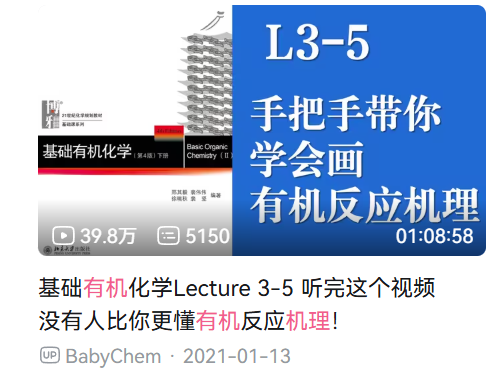

第三个是立体化学。这是一个比较难的内容，R、S 构型需要一些空间想象力，实在不能理解的话，可以看看 babychem 的网课，再实在不行也是可以背下来的。

最后是卤素的反应，涉及到一些 SN1、SN2 的竞争，以及构型翻转的内容和“闷声成大环”。书上的题目是必不可少的，一定要做（庞老师一般也会把这些布置为作业），也可以做邢大本和南开自己编纂的一本考研有机资料。

在南开教材改革后（25 级为第一年试用），醇酚醚的内容也进入了有机 2-1 的考试内容。一般注意像胞二醚机理画法、威廉姆森醚合成底物结构要求这样的小知识点，总体而言不会非常难。

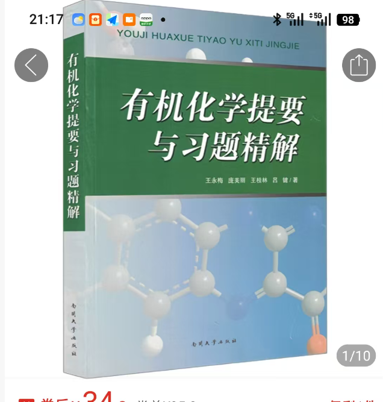

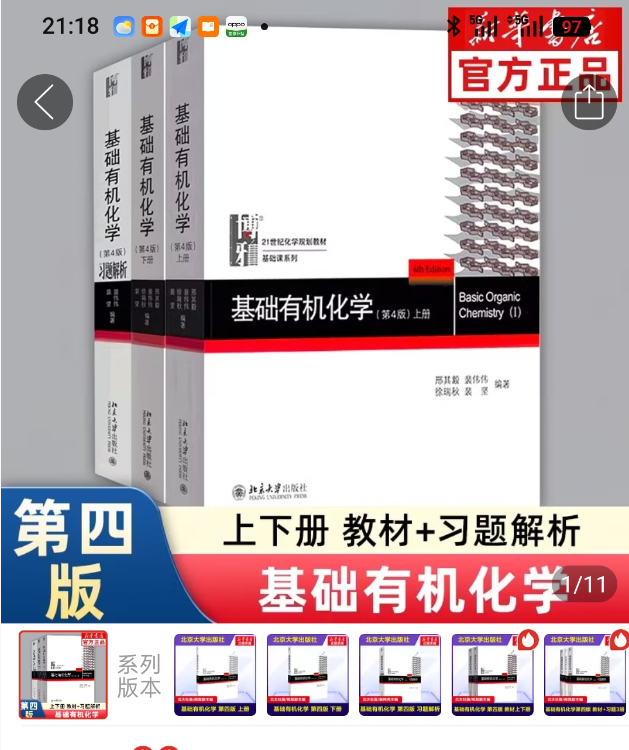

## 大学物理（I）（即普物力学）

力学是大家从高中以来的老朋友了，前面几章假设你上过学校的强基课，是简单且好理解的，直到刚体才出现一些新的概念。刚体里面的转动惯量，以及几个基本的公式，大家最好想想为什么要那样设置，分清楚是 confine 还是实验定律。平行轴定理是计算转动惯量的常考点。

力学很喜欢考察大家去列和解一些微分方程。提到微元法，那就不得不提关于拉船的一道题，用微元法去求角加速度、线加速度等，以及用导数去求等。

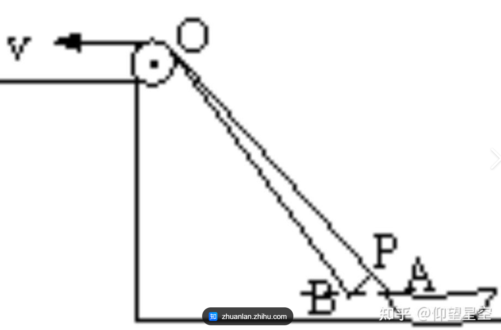

力学有时间大家可以读一读《新概念物理教程·力学》和舒幼生《力学》，没时间可以看看附在原指南中的普物视频。

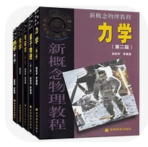

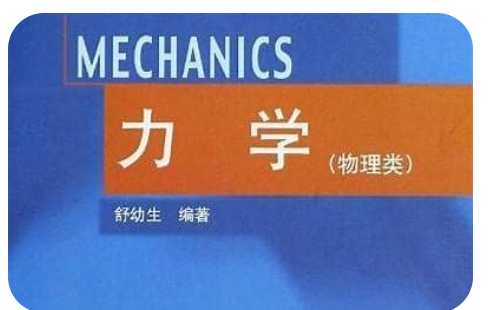

## 大学物理（II）（即普物热学）

大学物理（II）中的内容和物化 2-1 高度重合，对于可能提前修物化的同学，一定要好好修习大学物理 II。热力学三定律和麦克斯韦分布是大物 II 的主要内容。热力学三定律要求我们想明白微分（d）和变分（δ）的区别，不然很难搞懂什么时候吸热、什么时候放热，以及做功的正负。一道关于冰的相变（至气体）的题，便可以把三定律串起来。关于热力学循环的知识也不要忘记。有关麦克斯韦分布，首先要弄明白什么是分布和分布函数，又为什么要做归一化，以及带上各个特征量的加权平均的物理意义是什么。此外，麦克斯韦分布的式子也最好记住。

如果想深入一步学习，在选教材时若选择了物理方向的热学或者热力学及统计物理，可以不必看热传导和统计物理的大部分内容；若选择了物化教材，可以多做第三章、第四章的计算题，加深对热力学三定律的理解。

推荐书目：浙大的《物理化学讲义》（彭笑刚）、Atkins，以及任意的热学书（可以是《新概念物理教程·热学》）。

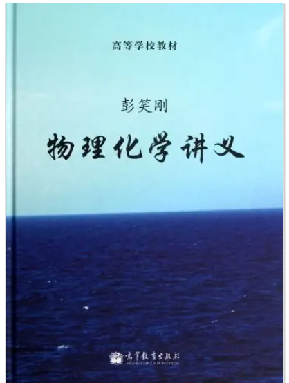

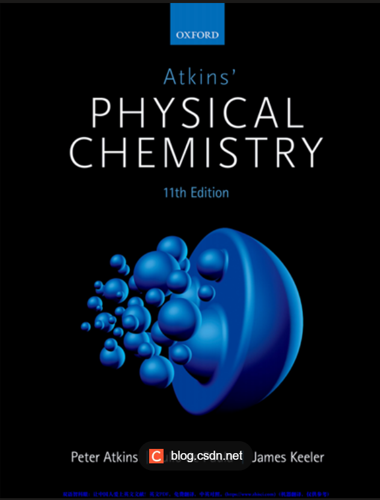

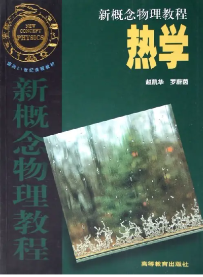

## 定量化学分析

这门课有大量需要记忆的东西，首先是关于概率统计，然后是各个使用条件下的公式、各种滴定、各种指示剂。公式建议最后自己推导一遍，会记得更牢。

B 站上有学长“Real_Zag”制作的考前速通视频，非常建议看一下。

（避雷 LS，讲课声音非常小，坐第一排啥都听不清。）

（定量分析选课规律：三字老师讲得比二字老师好。）

注意定量化学分析的题型已于 25 级发生改变，往年题的参考价值持续缩减。大家要尽可能去理解定量化学分析的各个概念，寻找它们的共性（比如酸碱滴定和配位滴定的公式、各个滴定对标准溶液的要求等）。

加注：定量化学分析这门课建议大家多看书，最好能按照课程讲授的进度把书通读一遍，一定不要想着留到期末考前复习再看，因为考前肯定没有这个时间。书上的细节在考试中是很可能会考到的。

## 高数 B（II）

高数 II 的重点是多元函数微积分，可以看作上册中一元微积分的衍生；关于级数的内容，可以看作极限和数列的延伸；至于 ODE（常微分方程）的部分，和力学以及热学部分相关性很强。总体来说，高数 B II 的部分难度上虽然更大，但是考试题目的难度也会相对低一些，主要考察计算能力。

（某个高度依赖计算器的学长留：一定要算得快！）

考试的主要考点是二次积分，以及高斯定理（这些在电磁学里面也会有所体现），旋度定理一般来说不作考察。对于 ODE 的部分，大家需要理解各个有解析解的微分方程的关系，从简单分离变量的，到齐次线性（常数变易法），再到伯努利方程……

考试压轴题一般是级数，大概率会是幂级数。这一部分大家可以好好看看北大高数 B 讲义。

高数 II 的推荐资料与高数 I 相同。原指南最后附有一份 2026 年的考试题，大家务必要看看。

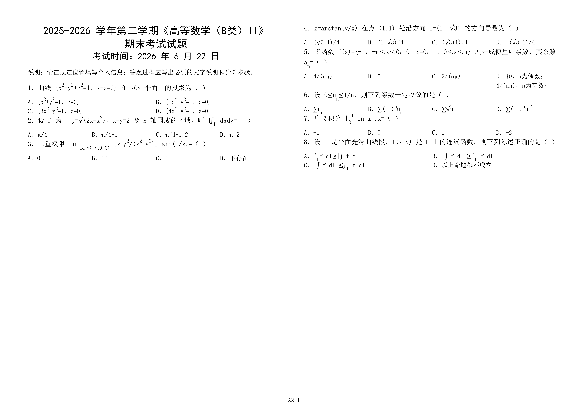

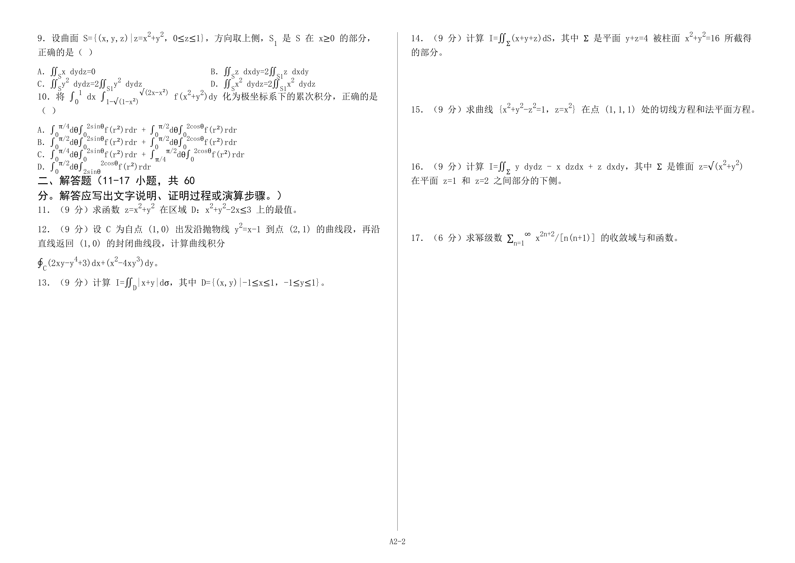

## 马克思主义基本原理

与思政课同理。

## 定量化学分析实验

正常操作即可。切记让你检测水中离子含量的时候，如果你自己取的水滴两滴就结束了，请用实验室提供的水重新进行实验；另外滤纸具有一定的还原性，别搅碎了溶在液体里面。
